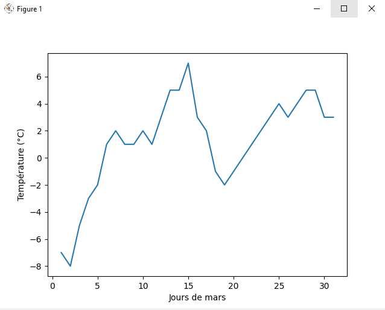
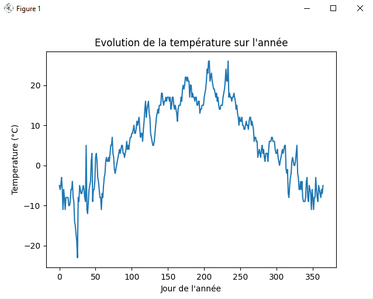
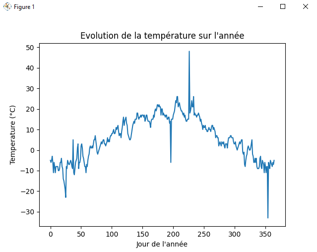
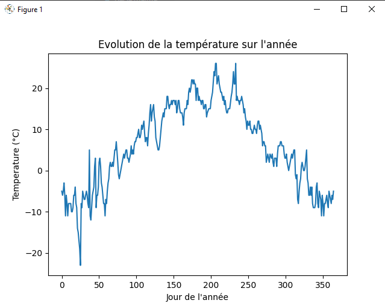

# tp1_climat

Import de la feuille `SI` du fichier `Climat.xlsx` à l'aide de la librairie `Pandas` : 
```
data_climat = pd.read_excel('./data/Climat.xlsx', 'SI ', header=2, usecols="D:O").iloc[1:32]
```

Calcul de la moyenne par mois :
```
np.mean(df)
```

Calcul de l'écart-type par mois :
```
np.std(df)
```

Calcul du minimum et du maximum par mois :
```
df.min()
df.max()
```

Traçage des courbes mensuelles :
```
month_number = 0
for month in data_climat.head():
    plt.xlabel('Jours de '+month)
    plt.ylabel('Température (°C)')
    plt.plot(df.iloc[:,month_number])
    month_number = month_number+1
    plt.show()
```

Aperçu pour le mois de Mars :



Traçage de la courbe annuelle avec curseur indiquant la valeur :
```
fig, ax = plt.subplots()

year_values = np.concatenate((df.iloc[:, 0], df.iloc[:, 1], df.iloc[:, 2], df.iloc[:, 3], df.iloc[:, 4], df.iloc[:, 5], df.iloc[:, 6], df.iloc[:, 7], df.iloc[:, 8], df.iloc[:, 9], df.iloc[:, 10], df.iloc[:, 11]))
year_values = [x for x in year_values if str(x) != 'nan']
line, = ax.plot(year_values)
ax.set(xlabel='Jour de l\'année', ylabel='Temperature (°C)', title='Evolution de la température sur l\'année')
annotation = ax.annotate("", xy=(0,0), xytext=(-20,20),textcoords="offset points", bbox=dict(boxstyle="round", fc="w"), arrowprops=dict(arrowstyle="->"))
annotation.set_visible(False)

fig.canvas.mpl_connect("motion_notify_event", hover)

plt.show()
```

Aperçu pour l'évolution de l'année :



Le code a été dubliqué pour manipuler la feuille `SI- erreur` et les erreurs ont été traitées de la manière suivant :
* les valeurs `Sun` et `0xFFFF` ont été remplacées par la moyenne de la somme entre la valeur du jour précédent et la valeur du jour suivant.
```
for month in range(len(df.count())):
    for day in range(len(df.iloc[:, month])):
        if df.iloc[day, month] == "0xFFFF" or df.iloc[day, month] == "Sun":
            df.iloc[day, month] = (df.iloc[day+1, month] + df.iloc[day-1, month])/2
```
* les valeurs aberrantes (Ex: -6 degrés en juillet) ont été remplacées de la même manière cependant la correction ne s'effectue qu'à condition que la valeur soit éloignée de la moyenne du mois à 20 degrés d'écart.
```
for month in range(len(df.count())):
    avg_month = np.mean(df.iloc[:, month])
    for day in range(len(df.iloc[:, month])):
        if np.abs(avg_month-df.iloc[day, month]) > 20:
            df.iloc[day, month] = (df.iloc[day+1, month] + df.iloc[day-1, month])/2
```

Les valeurs corrigées respectent globalement celles qui étaient indiquées dans la feuille `SI`.

Feuille avec remplacement des string          |  Feuille entièrement corrigée
:-------------------------:|:-----------:|:-----------:
  |   