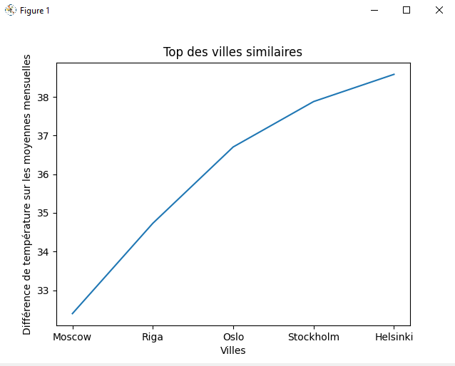
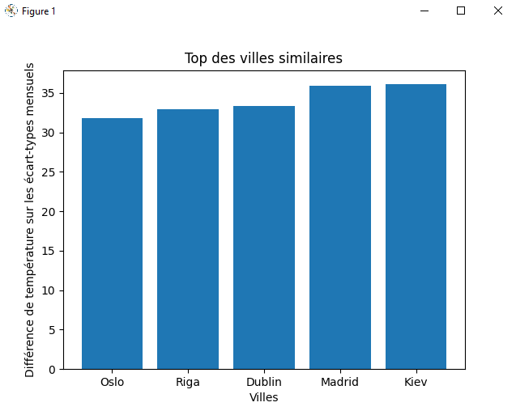
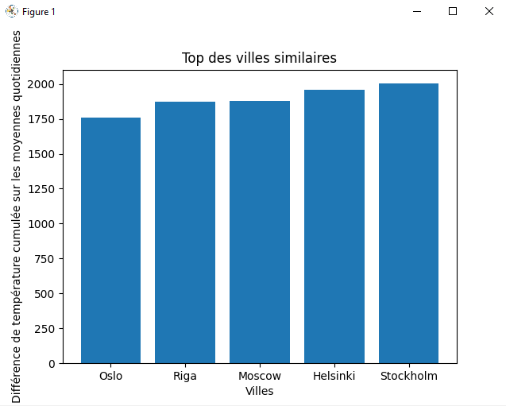
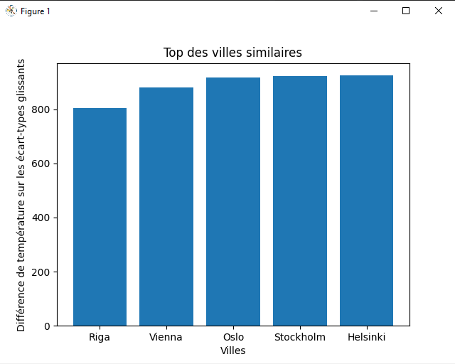

# tp1_climat

## Installation

Les librairies suivantes sont à installer pour faire fonctionner le projet.

Installation de `Scipy` :
```
pip install scipy
```
Installation de `Matplotlib` :
```
pip install matplotlib
```
Installation de `Pandas` :
```
pip install pandas
pip install xlrd
pip install openpyxl
```

## Travail sur la feuille SI 

Import de la feuille `SI` du fichier `Climat.xlsx` à l'aide de la librairie `Pandas` : 
```
data_climat = pd.read_excel('./data/Climat.xlsx', 'SI ', header=2, usecols="D:O").iloc[1:32]
```

Calcul de la moyenne par mois :
```
np.mean(df)
```

Calcul de l'écart-type par mois :
```
np.std(df)
```

Calcul du minimum et du maximum par mois :
```
df.min()
df.max()
```

Traçage des courbes mensuelles :
```
month_number = 0
for month in data_climat.head():
    plt.xlabel('Jours de '+month)
    plt.ylabel('Température (°C)')
    plt.plot(df.iloc[:,month_number])
    month_number = month_number+1
    plt.show()
```

Aperçu pour le mois de Mars :


Traçage de la courbe annuelle avec curseur indiquant la valeur :
```
fig, ax = plt.subplots()

year_values = np.concatenate((df.iloc[:, 0], df.iloc[:, 1], df.iloc[:, 2], df.iloc[:, 3], df.iloc[:, 4], df.iloc[:, 5], df.iloc[:, 6], df.iloc[:, 7], df.iloc[:, 8], df.iloc[:, 9], df.iloc[:, 10], df.iloc[:, 11]))
year_values = [x for x in year_values if str(x) != 'nan']
line, = ax.plot(year_values)
ax.set(xlabel='Jour de l\'année', ylabel='Temperature (°C)', title='Evolution de la température sur l\'année')
annotation = ax.annotate("", xy=(0,0), xytext=(-20,20),textcoords="offset points", bbox=dict(boxstyle="round", fc="w"), arrowprops=dict(arrowstyle="->"))
annotation.set_visible(False)

fig.canvas.mpl_connect("motion_notify_event", hover)

plt.show()
```

Aperçu pour l'évolution de l'année :


## Travail sur la feuille SI - erreur

Le code a été dubliqué pour manipuler la feuille `SI- erreur` et les erreurs ont été traitées de la manière suivant :
* les valeurs `Sun` et `0xFFFF` ont été remplacées par la moyenne de la somme entre la valeur du jour précédent et la valeur du jour suivant.
```
for month in range(len(df.count())):
    for day in range(len(df.iloc[:, month])):
        if df.iloc[day, month] == "0xFFFF" or df.iloc[day, month] == "Sun":
            df.iloc[day, month] = (df.iloc[day+1, month] + df.iloc[day-1, month])/2
```
* les valeurs aberrantes (Ex: -6 degrés en juillet) ont été remplacées de la même manière cependant la correction ne s'effectue qu'à condition que la valeur soit éloignée de la moyenne du mois à 20 degrés d'écart.
```
for month in range(len(df.count())):
    avg_month = np.mean(df.iloc[:, month])
    for day in range(len(df.iloc[:, month])):
        if np.abs(avg_month-df.iloc[day, month]) > 20:
            df.iloc[day, month] = (df.iloc[day+1, month] + df.iloc[day-1, month])/2
```

Les valeurs corrigées respectent globalement celles qui étaient indiquées dans la feuille `SI`.

Feuille avec remplacement des string          |  Feuille entièrement corrigée
:-------------------------:|:-----------:
  |   

## Enquête sur la capitale mystère 

La liste des capitales d'Europe a été récupérée sur ce [lien](https://worldpopulationreview.com/continents/capitals/europe) :

```
# Liste des capitales d'Europe (https://worldpopulationreview.com/continents/capitals/europe)
capitals = ["Mariehamn" ,"Tirana" ,"Andorra la Vella" ,"Vienna" ,"Minsk" ,"Brussels" ,"Sarajevo" ,"Sofia" ,"Zagreb" ,"Nicosia" ,"Prague" ,"Copenhagen" ,"Tallinn" ,"Tórshavn" ,"Helsinki" ,"Paris" ,"Berlin" ,"Gibraltar" ,"Athens" ,"St. Peter Port" ,"Budapest" ,"Reykjavik" ,"Dublin" ,"Douglas" ,"Rome" ,"Saint Helier" ,"Pristina" ,"Riga" ,"Vaduz" ,"Vilnius" ,"Luxembourg" ,"Skopje" ,"Valletta" ,"Chișinău" ,"Monaco" ,"Podgorica" ,"Amsterdam" ,"Oslo" ,"Warsaw" ,"Lisbon" ,"Bucharest" ,"Moscow" ,"City of San Marino" ,"Belgrade" ,"Bratislava" ,"Ljubljana" ,"Madrid" ,"Longyearbyen" ,"Stockholm" ,"Bern" ,"Kiev" ,"London" ,"Vatican City"]
```

On utilise un fichier récupéré sur [Kaggle.com](https://www.kaggle.com/sudalairajkumar/daily-temperature-of-major-cities). Ce fichier est filtré sur l'Europe, ses capitales uniquement ainsi que l'année 2018 (année utilisée également dans le fichier `Savukoski kirkonkyla.xlsx`) :

```
# Filtre sur l'année 2018 et sur les villes d'Europe en retirant les colonnes inutiles à l'analyse
df_kaggle = df_kaggle[(df_kaggle.Year == 2018) & (df_kaggle.Region == 'Europe') & (df_kaggle.City.isin(capitals))].drop(['Country', 'Region', 'State', 'Year'], 1)

# Conversion Fahrenheit ou Celsius
df_kaggle['AvgTemperature'] = (df_kaggle['AvgTemperature']-32)/1.8
```

Tout d'abord une comparaison est faites sur la moyenne mensuelle de chacun des mois :

```
# Comparaison de la moyenne des températures par mois avec le fichier mystère
for city in list(df_kaggle.groupby("City").groups):
    current_temperatures = list(df_kaggle.groupby("City").get_group(city).groupby("Month")['AvgTemperature'].mean())
    currentScore = compareListValuesSimilarity(list(np.mean(df_climat_SI)), current_temperatures)
    winnersTopAvg[city] = currentScore
winnersTopAvg = dict(sorted(winnersTopAvg.items(), key=lambda item: item[1]))
```

Puis une comparaison des écart-type mensuels :

```
# Comparaison de l'écart-type des températures par mois avec le fichier mystère
for city in list(df_kaggle.groupby("City").groups):
    current_temperatures = list(df_kaggle.groupby("City").get_group(city).groupby("Month")['AvgTemperature'].std())
    currentScore = compareListValuesSimilarity(list(np.std(df_climat_SI)), current_temperatures)
    winnersTopStd[city] = currentScore
winnersTopStd = dict(sorted(winnersTopStd.items(), key=lambda item: item[1]))
```

Pour finir, une comparaison est effectuée sur les moyennes des températures quotidiennes en comparant la grandeur de la différence entre le fichier mystère et les données de Kaggle :

```
# Comparaison des valeurs des températures par jour avec le fichier mystère
for city in list(df_kaggle.groupby("City").groups):
    current_temperatures = list(df_kaggle.groupby("City").get_group(city)['AvgTemperature'])
    currentScore = compareListValuesSimilarity(year_values, current_temperatures)
    winnersTopValues[city] = currentScore
winnersTopValues = dict(sorted(winnersTopValues.items(), key=lambda item: item[1]))
```

On obtient ensuite un graphique par méthode de calcul. Plus le score est faible, plus il est probable que la ville soit la bonne.

Comparaison des moyennes mensuelles |  Comparaison des écart-types mensuels |  Comparaison des moyennes quotidiennes | Comparaison des écart-types glissants
|:-------------------------:|:-----------:|:-----------:|:-----------:|
| Gagnant : Moscou  |  Gagnant : Oslo |  Gagnant : Oslo| Gagnant : Riga|
|  |   |   |  |


Affichage des 4 top 1 :

```
# Affichage de la ville gagnante en fonction de la méthode de calcul
print('Comparaison des moyennes mensuelles : '+ list(winnersTopAvg.keys())[0])
print('Comparaison des écart-types mensuels : '+ list(winnersTopStd.keys())[0])
print('Comparaison des moyennes quotidiennes : '+ list(winnersTopValues.keys())[0])
print('Comparaison des écart-types glissants : '+ list(winnersTopStdSlide.keys())[0])
```
